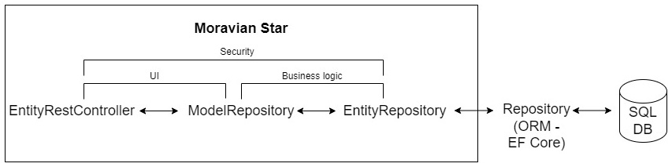

<p align="center">
    
</p>

# Moravian Star

## The .NET library that helps you focus on writing business code rather than technical code!

Moravian Star relies on EF Core and Hot Chocolate to allow you write less code for your WebAPI, GraphQL or console application that requires using SQL databases and common functionalities. There is a repository called: [Moravian Star - Demo](https://github.com/lneshev/MoravianStar-Demo), that demonstrates all features of the library.

## Table of Contents

- [Features](#features)
- [Installation](#installation)
- [Setup](#setup)
- [Usage](#usage)
- [The big picture](#the-big-picture)

## Features

### In Moravian Star's core project:

#### SQL related features:
- Customizable flows for CRUD operations over an entity or model (presentation model), as well as some other operations like: counting and checking for existence
- Dynamic filtering
- Dynamic sorting
- Pagination
- Ability to get the total number of records together with the limited set of data, in one line of code
- Transforming an entity to a model (or projection) and vice-versa
- Extended SQL transaction mechanism
- Working with multiple SQL databases

#### A service locator out of the box:
- According to some authors and developers this is an anti-pattern, but in order the customizable flows to be achieved, the only way was to use the service locator pattern

#### Some utilities, extensions and exceptions:
- Added some day-to-day helpful utilities, extensions and exceptions like: translation of enumerations, determining HTTP status code from exceptions and many more

### In Moravian Star WebAPI project:
- A common REST controller for CRUD and other operations over an entity and model
- A common Enum controller for working with enumerations
- Ability to mark a request (action) to execute in a single SQL transaction
- A common way to handle all exceptions
- An easy way to integrate request logging with the help of: [ElmahCore](https://www.nuget.org/packages/ElmahCore)
- Some helpful functionalities related to a WebAPI project like: hiding an action from the Swagger documentation, trimming white-spaces from every string field in every request and many more

### In Moravian Star GraphQL project:
- Ability to mark a mutation to execute in a single SQL transaction
- A common way to handle all exceptions
- An easy way to integrate request logging with the help of: [ElmahCore](https://www.nuget.org/packages/ElmahCore)


## Installation

Moravian Star is available on [NuGet](https://www.nuget.org/packages?q=MoravianStar).
- If you have a WebAPI project, you may install: [MoravianStar.WebAPI](https://www.nuget.org/packages/MoravianStar.WebAPI). This package depends on the core package: [MoravianStar](https://www.nuget.org/packages/MoravianStar), so probably you won't need to install it separately.

    ```sh
    dotnet add package MoravianStar.WebAPI
    ```

- If you are using GraphQL with HotChocolate, you may install: [MoravianStar.GraphQL](https://www.nuget.org/packages/MoravianStar.GraphQL). This package depends on the core package: [MoravianStar](https://www.nuget.org/packages/MoravianStar), so probably you won't need to install it separately.

    ```sh
    dotnet add package MoravianStar.GraphQL
    ```

- If you need the core functionalities, you may install: [MoravianStar](https://www.nuget.org/packages/MoravianStar).

    ```sh
    dotnet add package MoravianStar
    ```

## Setup

### For a WebAPI project:

1. In Startup.cs, in Configure method, add:
   ```c#
    public void Configure(IApplicationBuilder app, IWebHostEnvironment env)
    {
        if (env.IsDevelopment())
        {
            //...
        }

        app.UseMoravianStar(env);

        //...
    }
   ```
2. In Startup.cs, in ConfigureServices method, for each DbContext you have, register a scoped service like this:
    ```c#
    public void ConfigureServices(IServiceCollection services)
    {
        services.AddScoped<IDbTransaction<MyDbContext>, DbTransaction<MyDbContext>>();
    }
    ```
3. *(Optional)*: If you use Swagger, in Startup.cs, in ConfigureServices method, add the following filter:
    ```c#
    public void ConfigureServices(IServiceCollection services)
    {
        services.AddSwaggerGen(options =>
        {
            options.DocumentFilter<HideInDocsFilter>();
        });
    }
    ```
    This will hide from the Swagger documentation every endpoint that is marked with "NonInvokableAttribute" (exists in MoravianStar.WebAPI.Attributes). There are a lot of endpoints (actions) in the abstract EntityRestController in MoravianStar.WebAPI, so it is a very good idea to hide them.

### For a WebAPI project, that is configured to use HotChocolate (GraphQL) and the WebAPI controllers are not used at all, there is no need to setup anything in Startup.cs. There are certain attributes that should be applied in certain places, but this is explained in [Usage](#usage).

### For Console application (and probably others) do the following:
```c#
// 1. Init the DI container
// 2. Get the scoped services
// 3. Initialize Moravian Star's ServiceLocator and pass the scoped services as a parameter like this: 
new ServiceLocator(() => scopedServices);
// 4. Continue with your code...
```

## Usage

### Working with SQL data

Prerequisites for all examples below:
- "MoravianStar" project is referenced
- "MyDbContext" - an EF Core DbContext
- "User" class which inherits "EntityBase\<int\>" and is included in MyDbContext 
- "UserFilter" class which inherits "FilterSorterBase\<User\>"
- "UserProjection" class which inherits "ProjectionBase\<int\>"
- "UserModel" class which inherits "ModelBase\<int\>"
- *"UserModelMappingService" class which inherits ModelsMappingService<UserModel, User>
- *Registration of IModelsMappingService in DI container:
    ```c#
    services.AddTransient<IModelsMappingService<UserModel, User>, UserModelMappingService>();
    ```


*If you work with models, you have to create a service that implements interface IModelsMappingService into which you have to specify how the transformations between model, entity and vice-versa should happen. There is an abstract class - ModelsMappingService, that contains default logics, so it is recommended to be inherited as a starting point. These services should be registered in the DI container.

#### Read
```c#
// Reads all users from the DB
var users = await Persistence.ForEntity<User>().ReadAsync<UserFilter>();

// Reads all users from the DB, with name "John" (requires UserFilter to have property "NameEquals" and "Filter" method to be overridden and filled with a logic that specifies how property "NameEquals" should work)
var users = await Persistence.ForEntity<User>().ReadAsync<UserFilter>(new UserFilter() { NameEquals = "John" });

// Reads all users from the DB and sorts them by name descending (requires method "Sort" in UserFilter to be overriden and filled with a logic that specifies how the sorting should work)
var users = await Persistence.ForEntity<User>().ReadAsync<UserFilter>(sorts: new Sort[] { new() { Field = "Name", Dir = SortDirection.Desc } });

// Reads 10 users from the DB, skipping the first 10. Remark: since no sorting is specified, the final result might be different each time, so always combine the paging with the sorting
var users = await Persistence.ForEntity<User>().ReadAsync<UserFilter>(page: new Page() { PageSize = 10, PageNumber = 2 });

// Reads all users from the DB, as well as all roles for each user. For more info see: https://learn.microsoft.com/en-us/ef/core/querying/related-data/eager
var users = await Persistence.ForEntity<User>().ReadAsync<UserFilter>(includes: (x) => x.Include(y => y.Roles));

// Reads all users from the DB, with trackable option set to false (default is "true"). For more info see: https://learn.microsoft.com/en-us/ef/core/querying/tracking
var users = await Persistence.ForEntity<User>().ReadAsync<UserFilter>(trackable: false);

// Reads all users from the DB, together with their total count. In this case, two DB requests are initiated, so this option is "false" by default. This option respects the filtering, but not the paging.
var users = await Persistence.ForEntity<User>().ReadAsync<UserFilter>(getTotalCount: true);
var totalUsersCount = users.TotalCount;

// Reads only the IDs and the statuses of all users from the DB
var userIds = await Persistence.ForEntity<UserEntity>().ReadAsync<UserFilter, UserProjection>(projection: x => new UserProjection() { Id = x.Id, Status = x.Status });

// Generates a query that is about to read all users from the database, without executing it. Remark: all examples above, given for reading entities, are also applicable for this method
var usersQuery = Persistence.ForEntity<User>().ReadQuery<UserFilter>();

// Reads all users from the DB and transforms them into UserModels. Remark: all examples above, given for reading entities, are also applicable for reading models
var userModels = await Persistence.ForModel<UserModel, User>().ReadAsync<UserFilter>();
```

#### Filtering and sorting
To use the read functionality described above, you need to create a class that derives class "FilterSorterBase". This abstract base class allows you to specify how the filtering and sorting should happen for each individual entity in one central place.
- Filtering
    ```c#
    public class UserFilter : FilterSorterBase<User>
    {
        public string NameContainsInsensitive { get; set; }

        public override IQueryable<User> Filter<TDbContext>(IQueryable<User> query, IEntityRepository<User, TDbContext> repository)
        {
            query = base.Filter(query, repository);

            var mainCriteria = PredicateBuilder.New<User>(x => true);

            if (!string.IsNullOrEmpty(NameContainsInsensitive))
            {
                mainCriteria = mainCriteria.And(x => x.Name.ToLower().Contains(NameContainsInsensitive.ToLower()));
            }

            return query.Where(mainCriteria);
        }
    }
    ```
    - This approach allows you to make a dynamic filtering oven an entity, and in combination with the usage of models, this filtering can also be used from a web api or a client app.
    - Class "PredicateBuilder" is part of [LINQKit](https://github.com/scottksmith95/LINQKit) and allows you easily to create predicates. It is not necessary to use it. This is just an example of how you can implement the filtering for an entity. You have your own freedom to implement it as you wish.
    - By using methods "ReadQuery" you may create subqueries and use them in the main criteria.
- Sorting
    ```c#
    public class UserFilter : FilterSorterBase<User>
    {
        public override List<(Expression<Func<User, object>> expression, SortDirection direction)> Sort<TDbContext>(IEnumerable<Sort> sorts, IEntityRepository<User, TDbContext> repository)
        {
            var result = base.Sort(sorts, repository);

            foreach (var sort in sorts)
            {
                if (sort.Field.Equals("Name", StringComparison.OrdinalIgnoreCase))
                {
                    result.Add((x => x.Name, sort.Dir));
                }
            }

            return result;
        }
    }
    ```
    - This approach allows you to make a dynamic sorting oven an entity, and in combination with the usage of models, this sorting can also be used from a web api or a client app.
    - This is just an example of how you can implement the sorting for an entity. You have your own freedom to implement it as you wish.

#### Get by ID
```c#
// Gets user with ID=1 from the DB
var user = await Persistence.ForEntity<User, int>().GetAsync(1);

// Gets user with ID=1 from the DB, as well as the roles for this user. For more info see: https://learn.microsoft.com/en-us/ef/core/querying/related-data/eager
var user = await Persistence.ForEntity<User, int>().GetAsync(1, includes: (x) => x.Include(y => y.Roles));

// Gets user with ID=1 from the DB, with trackable option set to false (default is "true"). For more info see: https://learn.microsoft.com/en-us/ef/core/querying/tracking
var user = await Persistence.ForEntity<User, int>().GetAsync(1, trackable: false);

// Reads only the ID and the status of user with ID=1 from the DB
var user = await Persistence.ForEntity<User, int>().GetAsync(1, projection: x => new UserProjection() { Id = x.Id, Status = x.Status });

// Generates a query that is about to get user with ID=1 from the database, without executing it. Remark: all examples above, given for getting an entity by ID, are also applicable for this method
var userQuery = await Persistence.ForEntity<User, int>().GetQuery(1);

// Gets user with ID=1 from the DB and transforms it into a UserModel. Remark: all examples above, given for getting an entity by ID, are also applicable for this method
var userModel = await Persistence.ForModel<UserModel, User, int>().GetAsync(1);
```

#### Count

```c#
// Counts all users in the DB. A filter may be applied. The same functionality exist as a shortcut when working with models (Persistence.ForModel<>())
int usersCount = await Persistence.ForEntity<User>().CountAsync<UserFilter>();
```

#### Exist (check for existence)

```c#
// Checks if users exist in the DB. A filter may be applied. The same functionality exist as a shortcut when working with models (Persistence.ForModel<>())
bool usersExist = await Persistence.ForEntity<User>().ExistAsync<UserFilter>();
```

#### Save (create/update)

```c#
// Create example
// Creates a user entity and saves it into the DB
var user = new User() { Name = "John" };
await Persistence.ForEntity<User>().SaveAsync(user);

// Create example
// Creates a user model (such may come from a HTTP request), transforms it into a user entity (internally) and saves it into the DB. Returns the same model (unless there is a custom logic that modifies it upon the transformations), which contains the assigned user's ID
var userModel = new UserModel() { Name = "John" };
userModel = await Persistence.ForModel<User>().CreateAsync(userModel);

// Update example
// Gets a user entity with ID=1 from the DB, modifies it and saves it into the DB
var user = await Persistence.ForEntity<User, int>().GetAsync(1);
user.Name = "John Smith";
await Persistence.ForEntity<User>().SaveAsync(user);

// Update example
// Creates a user model (such may come from a HTTP request), gets a user entity with ID=userModel.Id (internally), transforms it into a user entity (internally) and saves it into the DB. Returns the same model (unless there is a custom logic that modifies it upon the transformations)
var userModel = new UserModel() 
{
    Id = 1,
    Name = "John Smith"
};
userModel = await Persistence.ForModel<UserModel, UserEntity, int>().UpdateAsync(userModel);
```

- Upon saving an entity you may plug your custom business logic by creating services that implements the following interfaces:
  - IGetOriginalEntity
  - IEntityValidating
  - IEntityValidated
  - IEntitySaving
  - IEntitySaved
- If you need to check if you are about to create or update an entity, you may use method "IsNew" of the entity itself. In a service that implements interface "IEntitySaved" you may get this information from the input parameter "entityWasNew".

#### Delete

```c#
// Gets a user entity with ID=1 from the DB and deletes it
var user = await Persistence.ForEntity<User, int>().GetAsync(1);
await Persistence.ForEntity<User>().DeleteAsync(user);

// Finds a user entity with ID=1 in the DB (internally) and if it exists, deletes it
await Persistence.ForEntity<User, int>().DeleteAsync(1);

// Finds a user entity with ID=1 in the DB (internally) and if it exists, deletes it and returns a user model in a way that it would look alike right before the deletion
var userModel = await Persistence.ForModel<UserModel, User, int>().DeleteAsync(1);
```
- Upon deleting an entity you may plug your custom business logic by creating services that implements the following interfaces:
  - IEntityDeleting
  - IEntityDeleted

#### Entity-to-model and model-to-entity transformations
These transformations are triggered when you use Persistence.ForModel<>() methods. To specify how an entity should be converted (transformed) to a model (and vice-versa), create a service that implements interface IModelsMappingService. There is an abstract class - ModelsMappingService, that contains default logics, so it is recommended to be inherited as a starting point. A such service should be registered in the DI container.

- Entity-to-model transformations occur when you are about to read data from the DB. To specify how this transformation should happen, there are several options - some required and some not:
  - (Required) Override method "Project". This method specifies which fields of an entity should be read from the DB and to which class they should be stored. The class should implement either "IModelBase" or "IProjectionBase":
    ```c#
    // Here only user's ID and user's name will be read from the DB. This is equivalent to SQL query "SELECT Id, Name FROM User ..."
    public class UserModelMappingService : ModelsMappingService<UserModel, User>
    {
        public override Expression<Func<User, IProjectionBase>> Project()
        {
            return entity => new UserModel()
            {
                Id = entity.Id,
                Name = entity.Name
            };
        }
    }
    ```
  - (Optional) Override method "Project" and method "MapAsync". Method "MapAsync" extends the functionality of "Project" method by allowing filling other properties of a single model with data that didn't come with the entity and comes from a different place, like a C# code, *a different query to the DB, *external web API and so on:
    ```c#
    public class UserModelMappingService : ModelsMappingService<UserModel, User>
    {
        public override Expression<Func<User, IProjectionBase>> Project()
        {
            return entity => new UserProjection()
            {
                Id = entity.Id,         // int
                Name = entity.Name,     // string
                Status = entity.Status  // enum of type UserStatus
            };
        }

        public override async Task<UserModel> MapAsync(IProjectionBase projection)
        {
            // The actual type is UserProjection, but we need to cast it. The type comes from the type that is returned in method "Project"
            var proj = (UserProjection)projection;

            return await Task.FromResult(new UserModel()
            {
                Id = proj.Id,                                       // int
                Name = proj.Name,                                   // string
                Status = proj.Status,                               // enum of type UserStatus
                StatusText = proj.Status.Translate(typeof(Strings)) // string. Enum's value is being translated
            });
        }
    }
    ```
    *Keep in mind that this method is called for every entity that was returned from the DB. So if you need to call the DB for a different query, an external API or other extensive method to get the additional data, it will be executed N times, where N is the number of returned entities from the DB. This might be crucial for the performance, so in this case it is better to override method "ToModels" (see next point).
  - (Optional) Override method "Project" and method "ToModels". Method "ToModels" extends the functionality of "Project" method by allowing filling other properties of multiple models with data that didn't come with the entity and comes from a different place, like a C# code, a different query to the DB, external web API and so on:
    ```c#
    public class UserModelMappingService : ModelsMappingService<UserModel, User>
    {
        public override Expression<Func<User, IProjectionBase>> Project()
        {
            return entity => new UserProjection()
            {
                Id = entity.Id,
                ExternalApiReference = entity.ExternalApiReference
            };
        }

        public Task<List<ProjectionModelPair<IProjectionBase, UserModel>>> ToModels(List<ProjectionModelPair<IProjectionBase, UserModel>> pairs)
        {
            var usersDataFromAPI = await FillUsersDataFromExternalAPI();

            foreach (var pair in pairs)
            {
                var proj = (UserProjection)pair.Projection;

                pair.Model = new UserModel()
                {
                    Id = proj.Id,
                    PropertyFromExternalAPI = usersDataFromAPI[proj.ExternalApiReference]
                };
            }

            return pairs;
        }

        private async Task<Dictionary<Guid, string>> FillUsersDataFromExternalAPI()
        {
            // Call to an external web API...
        }
    }
    ```
-  Model-to-entity transformations occur when you are about to save data in the DB. To specify how this transformation should happen, override (or implement) method "ToEntities":
    ```c#
    public class UserModelMappingService : ModelsMappingService<UserModel, User>
    {
        public override async Task<List<EntityModelPair<User, UserModel>>> ToEntities(List<EntityModelPair<User, UserModel>> pairs)
        {
            pairs = await base.ToEntities(pairs);

            foreach (var pair in pairs)
            {
                pair.Entity.Name = pair.Model.Name;
            }

            return pairs;
        }
    }
    ```
    Here, if you need to check if you are about to create or update a model, you may use method "IsNew" of the model itself.

    Additionally, if you have a business logic upon updating or deleting an entity that should access navigation properties or collections of an entity (and you do not use EF core's lazy loading), you should specify them in method "GetIncludes":
    ```c#
    // File: UserModelMappingService.cs
    public class UserModelMappingService : ModelsMappingService<UserModel, User>
    {
        public override IQueryable<User> GetIncludes(IQueryable<User> query)
        {
            return base.GetIncludes(query).Include(x => x.Roles);
        }
    }

    // File: UserSaving.cs
    public class UserSaving : IEntitySaving<User>
    {
        public async Task SavingAsync(User entity, User originalEntity, IDictionary<string, object> additionalParameters = null)
        {
            if (!entity.Roles.Any())
            {
                throw new BusinessException("The user should have at least one role assigned.");
            }
        }
    }
    ```

#### DB transaction

Moravian Star has an extended way to handle DB transactions compared to EF Core's DB transaction. Internally, it relies on EF Core's Db transaction, but adds some additional functionalities.

To execute a code in a DB transaction, do the following:

1. Register IDbTransaction service like this for your DbContext:
      ```c#
      services.AddScoped<IDbTransaction<MyDbContext>, DbTransaction<MyDbContext>>();
      ```
2. Get an instance of IDbTransaction service via DI or ServiceLocator
3. Use the provided methods in this service to Begin, Commit or Rollback a transaction

Example:
```c#
var dbTransaction = (IDbTransaction)ServiceLocator.Container.GetRequiredService(serviceType);
await dbTransaction.BeginAsync();

try
{
    var user1 = new User() { Name = "John Smith" };
    var user2 = new User() { Name = "John Doe" };
    await Persistence.ForEntity<User>().SaveAsync(user1);
    await Persistence.ForEntity<User>().SaveAsync(user2);
}
catch
{
    await dbTransaction.RollbackAsync();
    throw;
}

await dbTransaction.CommitAsync();
```

This way:
1. You won't be able to begin a new DB transaction, before you either commit or rollback the current one. This is done intentionally.
2. Upon commit a transaction you may plug your custom business logic by creating event handlers for the following events:
   - Committing
   - Committed

    Example:
    ```c#
    // Here we have implemented service IEntitySaved. Method SavedAsync triggers when a user entity was saved successfully via Persistence.ForEntity<User>().SaveAsync(user);. This means that every time a user is saved, a new committed event handler will be added and once the transaction is successfully committed, all stored committed event handlers will be executed
    public async Task SavedAsync(UserEntity entity, UserEntity originalEntity, bool entityWasNew, IDictionary<string, object> additionalParameters = null)
    {
        Persistence.ForDbContext<MyDbContext>().DbTransaction.Committed += (sender, eventArgs) =>
        {
            // Write your custom logic that will be executed only when the DB transaction was committed successfully. An example for such logic could be sending an email, uploading a picture, start a job, etc.
        };

        await Task.CompletedTask;
    }
    ```

Recommendation:
Always use Moravian Star's way to handle DB transactions, because of the latter functionalities. Also, it is very important to prevent saving without a transaction, by overriding SaveChanges and SaveChangesAsync methods in your DbContext, like this:
```c#
public class SystemContext : DbContext
{
    //...

    public override int SaveChanges(bool acceptAllChangesOnSuccess)
    {
        OnBeforeSaving();
        return base.SaveChanges(acceptAllChangesOnSuccess);
    }

    public override async Task<int> SaveChangesAsync(bool acceptAllChangesOnSuccess, CancellationToken cancellationToken = default)
    {
        OnBeforeSaving();
        return await base.SaveChangesAsync(acceptAllChangesOnSuccess, cancellationToken);
    }

    private void OnBeforeSaving()
    {
        if (Database.CurrentTransaction == null)
        {
            throw new InvalidOperationException("Saving data to a database without a transaction is not allowed. First open a database transaction and then save&commit the changes.");
        }
    }
}
```

#### Working with a different DbContext

All examples above required setting a default DbContext upon app's initialization like this: 

```c#
// Sets the default DbContext type upon app's initialization.
app.UseMoravianStar(env, () =>
{
    Settings.DefaultDbContextType = typeof(MyDbContext);
});
```

If you have to use a different DbContext or if you prefer not to set a default DbContext, then you can access all of the above methods like this:
```c#
var users = await Persistence.ForDbContext<MyDbContext>.ForEntity<User>().ReadAsync<UserFilter>();
```

### WebAPI features

#### EntityRestController

The EntityRestController is an abstract base api controller that contains the most common operations over an entity and model (like CRUD, count, exist, etc.), defined in the REST standard. Internally, each of its methods for these operations call the model repository service.

To start using the functionalities of this controller first you need to create your own controller for your entity, model, filter and dbContext, and derive the EntityRestController:

```c#
public class UserController : EntityRestController<User, int, UserModel, UserFilter, MyDbContext>
{
}
```

At this stage and despite that you derived the controller, there are still no endpoints that are exposed. This is done intentionally as a security measure and with the idea that you may want for a given entity and model to expose just some of its operations (for example: only read, but not create, update, delete and the rest). It is achieved by filter attribute: "NonInvokable" that will throw "MethodAccessException" if someone decides to try to access an action in the controller that is not overridden explicitly. So, in order an endpoint to be visible to the audience, you should explicitly override the desired action (and call the base logic and/or write your own):

- Read:
    ```c#
    public class UsersController : EntityRestController<User, int, UserModel, UserFilter, MyDbContext>
    {
        public override Task<ActionResult<PageResult<UserModel>>> Read([FromQuery] UserFilter filter, [FromQuery] List<Sort> sorts, [FromQuery] Page page)
        {
            return base.Read(filter, sorts, page);
        }
    }
    ```
    ```
    // Example "read" request:
    Request method: GET
    Request URL: https://localhost:80/api/users?
        NameContainsInsensitive=John
        ExcludeIds[0]=1
        sorts[0].field=Name&
        sorts[0].dir=0&
        PageNumber=1&
        PageSize=10
    ```
- Get by ID
    ```c#
    public class UsersController : EntityRestController<User, int, UserModel, UserFilter, MyDbContext>
    {
        public override async Task<ActionResult<UserModel>> Get([FromRoute] int id)
        {
            return await base.Get(id);
        }
    }
    ```
    ```
    // Example "get by ID" request:
    Request method: GET
    Request URL: https://localhost:80/api/users/1
    ```
- Count
    ```c#
    public class UsersController : EntityRestController<User, int, UserModel, UserFilter, MyDbContext>
    {
        public override async Task<ActionResult<int>> Count([FromQuery] UserFilter filter)
        {
            return await base.Count(filter);
        }
    }
    ```
    ```
    // Example "count" request:
    Request method: GET
    Request URL: https://localhost:80/api/users/count?
        NameContainsInsensitive=John
        ExcludeIds[0]=1
    ```

- Exist
    ```c#
    public class UsersController : EntityRestController<User, int, UserModel, UserFilter, MyDbContext>
    {
        public override async Task<ActionResult<int>> Exist([FromQuery] UserFilter filter)
        {
            return await base.Exist(filter);
        }
    }
    ```
    ```
    // Example "exist" request:
    Request method: GET
    Request URL: https://localhost:80/api/users/exist?
        NameContainsInsensitive=John
        ExcludeIds[0]=1
    ```

- Create
    ```c#
    public class UsersController : EntityRestController<User, int, UserModel, UserFilter, MyDbContext>
    {
        public override async Task<ActionResult<UserModel>> Post([FromBody] UserModel model)
        {
            return await base.Post(model);
        }
    }
    ```
    ```
    // Example "create" request:
    Request method: POST
    Request URL: https://localhost:80/api/users
    Request body:
    {
    // All properties from UserModel
    "id": 0,
    "name": "John Smith"
    }
    ```

- Update
    ```c#
    public class UsersController : EntityRestController<User, int, UserModel, UserFilter, MyDbContext>
    {
        public override async Task<ActionResult<UserModel>> Put([FromRoute] int id, [FromBody] UserModel model)
        {
            return await base.Put(id, model);
        }
    }
    ```
    ```
    // Example "update" request:
    Request method: PUT
    Request URL: https://localhost:80/api/users/1
    Request body:
    {
    // All properties from UserModel
    "id": 1,
    "name": "John Doe"
    }
    ```

- Delete
    ```c#
    public class UsersController : EntityRestController<User, int, UserModel, UserFilter, MyDbContext>
    {
        public override async Task<ActionResult<UserModel>> Delete([FromRoute] int id)
        {
            return await base.Delete(id);
        }
    }
    ```
    ```
    // Example "delete" request:
    Request method: DELETE
    Request URL: https://localhost:80/api/users/1
    ```

Additional remarks about EntityRestController:
- The endpoints for "Read", "Create", "Update" and "Delete" execute in a SQL transaction by default, so there is no need to write any additional code and the whole HTTP request will be executed in a single SQL transaction. This is achieved by marking these endpoints with "ExecuteInTransactionAsync" attribute in EntityRestController. By default, the SQL transaction will be for the default DbContext that you have specified as such (see: [Working with a different DbContext](#working-with-a-different-dbcontext)). If you want the SQL transaction to be for a different DbContext, you should override the desired action (endpoint) and mark it with: "\[ExecuteInTransactionAsync(typeof(OtherDbContext))]". If you want to execute the action (endpoint) not in a SQL transaction, then you should override the desired action and mark it with: "\[ExecuteInTransactionAsync(false)"].
- The endpoints in this controller return the data in a specific format. To change the format you may create your own base controller and reuse the logics from "EntityRestControllerHelper".

#### EnumsController

The EnumsController is an api controller that provides endpoints for retrieving enumerations in different ways:
- Endpoint: **[GET] "/api/enums"** returns all enums defined in Moravian Star (like: "SortDirection" that is used to specify the sorting direction when using the read functionality) together with enums from your project. To specify which enums to be exposed from your project, set setting: "AssemblyForEnums" upon app's initialization:
    ```c#
    // Sets the assembly for the enums upon app's initialization.
    app.UseMoravianStar(env, () =>
    {
        Settings.AssemblyForEnums = typeof(UserStatus).Assembly;
    });
    ```
    This endpoint will return a JSON array like this:
    ```json
    [
        {
            "name": "SortDirection", // Exist in MoravianStar
            "values": {
                "Asc": 0,
                "Desc": 1
            }
        },
        {
            "name": "UserStatus", // Exist in your project
            "values": {
                "Inactive": 0,
                "Active": 1
            }
        }
    ]
    ```
    The purpose for this endpoint can be to help a front-end app to store all these enums in a dictionary and later use this dictionary to check some values like this: "model.status === enums.UserStatus.Active ? ...", for example.
- Endpoint: **[GET] "/api/enums/{enumName}"** returns the values of a single enum in multiple formats like its integer value, its string value and its translated string value. Similarly to the latter endpoint (described above), this endpoint can return enums from Moravian Star, as well as enums from your project. Again you need to specify which enums to be exposed from your project by set setting: "AssemblyForEnums" as well as "StringResourceTypeForEnums" upon app's initialization:
    ```c#
    // Sets the assembly for the enums upon app's initialization.
    app.UseMoravianStar(env, () =>
    {
        Settings.AssemblyForEnums = typeof(UserStatus).Assembly;
        Settings.StringResourceTypeForEnums = typeof(Strings);
    });
    ```
    This endpoint will return a JSON array like this:
    ```json
    // For enum "UserStatus" the result could be:
    [
        {
            "value": 0,
            "stringValue": "Inactive",
            "text": "Неактивен" // "Inactive" translated in Bulgarian
        },
        {
            "value": 1,
            "stringValue": "Active",
            "text": "Активен" // "Active" translated in Bulgarian
        }
    ]
    ```
    This endpoint has two optional parameters:
    - "exactEnumValues" (default: []) - a list of int values. When set, only those values will be returned. For example:
        ```json
        // [GET] "/api/enums/UserStatus?exactEnumValue[0]=1" will return only one element:
        [
            {
                "value": 1,
                "stringValue": "Active",
                "text": "Активен" // "Active" translated in Bulgarian
            }
        ]
        ```
    - "sortByText" (default: false) - boolean parameter that specifies if the values in the result should be sorted by property "text" (when passed "true") or by property "value" (when passed "false").

    The purpose for this endpoint can be to help a front-end app to populate enum's values in a dropdown, for example.

#### Exception handling
There is a custom exception middleware called: "ExceptionMiddleware", that catches any exception, logs the exception, creates a generic error model, generates a correct HTTP status code related to the exception, puts it into the error model and writes the error model to the response. The middleware is registered together with MoravianStar's initialization (app.UseMoravianStar(env);), but you may register it individually, too.

```
// An example HTTP request and response for EntityNotFoundException (an exception in MoravianStar that is thrown when an entity could not be found by ID):
Request method: GET
Request URL: https://localhost:80/api/users/1
Response status code: 404
Response body:
{
    "message": "An entity of type: 'User' with ID: '1' was not found.", // Exception's message
    "exceptionType": "MoravianStar.Exceptions.EntityNotFoundException", // Exception's full name. Filled-in only for development environments
    "stackTrace": "..." // The whole stack trace. Filled-in only for development environments
}
```

The HTTP status code is set based on the exception thrown. You can find this logic in: "ExceptionExtensions.GetHttpStatusCode(ex)".

If you use [ElmahCore](https://github.com/ElmahCore/ElmahCore) library to log the exceptions, you may use this exception extension method ("ExceptionExtensions.GetHttpStatusCode(ex)") to set the correct HTTP status code in the ElmahCore's log like this:
```c#
services.AddElmah<SqlErrorLog>(options =>
{
    options.OnError = async (httpContext, error) =>
    {
        if (error.Exception != null)
        {
            error.StatusCode = error.Exception.GetHttpStatusCode();
        }
        await Task.CompletedTask;
    };
});
```

Also, there is an attribute called: "ValidateModelStateAttribute", which collects all model state errors, creates a message from them and throws an InvalidModelStateException with that message. If you want to use it, you should register it globally and also set option "SuppressModelStateInvalidFilter" to "true":
```c#
services.AddControllers(options =>
{
    options.Filters.Add<ValidateModelStateAttribute>();
});

services.Configure<ApiBehaviorOptions>(options =>
{
    // This options is set to "true", because the logic in ValidateModelStateAttribute 
    // won't be executed for controllers marked with ApiControllerAttribute
    options.SuppressModelStateInvalidFilter = true;
});
```

If you want to modify the logic in the ExceptionMiddleware, first disable it and second derive from it and register your custom middleware (or don't derive from it at all).

```c#
// Disables the default exception middleware upon app's initialization.
app.UseMoravianStar(env, () =>
{
    Settings.RegisterDefaultExceptionMiddleware = false;
});
```

#### Logging of HTTP requests
MoravianStar WebAPI uses [ElmahCore](https://github.com/ElmahCore/ElmahCore) library to provide a logging of not only failed HTTP requests, but also of successful such. This is useful mostly for debugging/tracing cases. To use this functionality:
1. Add and setup [ElmahCore](https://github.com/ElmahCore/ElmahCore) library in your project
2. Mark any of your actions with attribute: "[ElmahRaiseLog]".

#### Other WebAPI functionalities
MoravianStar.WebAPI contains various model binders, json converters and transformers like such that trim white-space characters from any string property, unify the naming of the endpoints and others.

### GraphQL features
All GraphQL features in Moravian Star are based on [Hot Chocolate](https://chillicream.com/docs/hotchocolate) library. They can be found in MoravianStar.GraphQL project and namespace.

#### UseServiceLocator attribute
This attribute should be applied on any query, mutation or subscription that requires access to MoravianStar's SQL features. Internally, it initializes MoravianStar's ServiceLocator, similarly to what does "app.UseMoravianStar(env);" in a WebAPI startup.

```c#
// A sample GraphQL query that reads users.
[UseServiceLocator]
[UseOffsetPaging]
[UseProjection]
[GraphQLDescription("Gets the queryable users.")]
public IQueryable<User> GetUsers(UserFilter filter, List<Sort> sorts)
{
    return Persistence.ForDbContext<MyDbContext>().ForEntity<User>().ReadQuery(filter, sorts, trackable: false);
}
```

#### UseTransactionAttribute attribute
This attribute should be applied on any query, mutation or subscription that requires the SQL related code inside them to be executed in a single SQL transaction.

```c#
// A sample GraphQL mutation that deletes a user (found by its ID) and its main address.
// All statements will be executed in a single SQL transaction.
[UseServiceLocator]
[UseTransaction]
[GraphQLDescription("Deletes a user.")]
public async Task<bool> DeleteUserAsync([ID] int id)
{
    var user = await Persistence.ForEntity<User, int>().GetAsync(id);

    if (user.MainAddressId.HasValue)
    {
        await Persistence.ForEntity<Address, Guid>().DeleteAsync(user.MainAddressId.Value);
    }

    await Persistence.ForEntity<User>().DeleteAsync(user);

    return true;
}
```

#### Error filters
- ErrorImproverErrorFilter - This error filter is similar to the ExceptionMiddlleware for WebAPI. It additionally modifies the error model, returned from Hot Chocolate upon exception, by setting the correct message and HTTP status code. To use it, just include it as a regular error filter:
  ```c#
  services
    .AddGraphQLServer()
    .AddErrorFilter<ErrorImproverErrorFilter>()
  ```
- ElmahErrorFilter - This is an error filter that logs an exception with the help of ElmahCore. To use it, just include it as a regular error filter. If you also use ErrorImproverErrorFilter, it should be added after:
  ```c#
  services
    .AddGraphQLServer()
    .AddErrorFilter<ErrorImproverErrorFilter>()
    .AddErrorFilter<ElmahErrorFilter>()
  ```

### Additional features

#### Translation of enum and boolean types
Moravian Star has a functionality to translate enumerations. It exists as method: "EnumExtensions.Translate()". In order to work properly, you should put enum's values in a string resource file (.resx file) in the following pattern: "[EnumName]_[EnumValue]". Example:

```
// In a .resx file:
Key                     Value
UserStatus_Active       Active
UserStatus_Inactive     Inactive
```

```c#
// Getting a translated enum value:
string translatedEnumValue = user.Status.Translate(typeof(Strings));
```

It is recommended to put all enums in a single project as well as they to have unique names.

Translating a boolean value in pretty much the same. The two keys for the boolean values in the string resource file are: "Boolean_True" and "Boolean_False".

#### Exceptions

In certain cases, Moravian Star (or you) may throw the following exceptions:
- BusinessException - The exception that is thrown when a business logic error occurs.
- EntityNotFoundException - The exception that is thrown when an entity could not be found.
- EntityNotUniqueException - The exception that is thrown when trying to create or update an entity which conflicts with another entity by uniqueness.
- InvalidModelStateException - The exception that is thrown when some property or collection in the model state is not valid.

#### Extensions
There are some extension methods for working with strings, lists, DateTime on so. You may find them in namespace: "MoravianStar.Extensions".

## The big picture

In projects, which primary rely on SQL to read and store data, the flow usually is such:
- for reading: the client has certain number of filtering, sorting and paging mechanisms, he/she forms a query, sends it to the server, the server process it and returns the results to the client based on the query
- for saving: the data is read from a storage (SQL database), given to an API or UI, edited there and then send back for saving.

Of course, this is accompanied by business logics, security, optimizations and so on.

Usually, the developer would write one and the same common logic for each entity without knowing it. Even more, very soon the developer will need to reuse parts of the business logic, but not always this may be possible, because different contracts might be used in the different services.

So, Moravian Star is here to solve all the problems from the beginning by extracting the common logic and give the developer only the points where he/she can write the business logic.

The major concept is presented in the following diagram:



On the left side we have the WebAPI controllers (or could be any other technology which connects the UI with the business logic) and to the right we have the SQL database. Usually between them is the business logic, written in some services, that uses the chosen ORM to communicate with the database. Here, again we have this ORM and for Moravian Star this is Entity Framework Core (EF Core). In theory, it could be any other like: nHibernate, Dapper or just ADO.NET, but EF Core was chosen as most modern, fast enough, well documented and continuously maintained and developed.

Between the Controllers and the ORM, sit the ModelRepository and EntityRepository as services. They contain all the repetitive logics for each individual entity like the CRUD operations, and operations like counting and checking for existence, but they also provide points where you may plug your own business logic. They are accessible through the static class: Persistence.ForEntity<>() and Persistence.ForModel<>().

EntityRespository service consists of CRUD methods related to a given entity. In the implementations of this service, additional business logics might be added in certain points of the operations (for example executing specific logics before or after saving/deleting of an entity) by creating and registering services that implements specific interfaces. In the latter services you may call the EntityRepository service again. For example, if you need to save a user, who has a MainAddress property of type Address and the type Address has a property Country which is mandatory and should be one of 5 predefined countries, then you may create IEntityValidated service for Address entity, put the logic for the 5 countries there and create IEntitySaving service for the user, where you may put a call for saving the MainAddress, which will automatically trigger the checking logic for the 5 countries. This way, you can chain and reuse existing logics with just one line of code.

ModelRepository service consists of CRUD methods related to a given entity and model. This means that for a given entity there might be one or more models. Imagine that you have a front-end app where you need to show all users in the system in a table (like an overview), but you show just few user's properties like: email, first name, last name and status. There is a button Edit next to each user in the table, which once clicked leads to a detailed page for the selected user, where you may edit all user's properties - not only first name, last name, but also password, main address, additional addresses and so on. So, in this case you present the user in two ways and you may create two models for each need. This leads to better performance, security and reusability of the code.

The ModelRepository service depends on other service called IModelsMappingService, which contains generic logics that transfers the entities to a model and vice versa, without to specify "how" they will be transferred. In order to specify this, you should create and register services that implements this interface. There is an abstract base class called ModelsMappingService that implements all methods with default logics and can be used as a starting point.

In other words, imagine an SQL query:
```sql
SELECT COLUMN1, COLUMN2
FROM TABLE1
WHERE COLUMN1 = SomeValue
ORDER BY COLUMN1 ASC
OFFSET 0 ROWS FETCH NEXT 10 ROWS ONLY
```

, then the ModelRepository service handles the "SELECT" clause and EntityRepository service handles the rest clauses as well as the "SELECT" clause, but retrieving all columns, unless something else is specified. At this stage, only these features are supported. Features like grouping and aggregation of data are not directly supported, but you may reuse the build query and extend it manually for your need.

EntityRepository service gives the ability for dynamic filtering and dynamic sorting, which means that the rules for these operations can be defined at one central place and whoever decides to filter or sort an entity (or a model) may choose any desired combination. This leads to better security and reusability of the code.